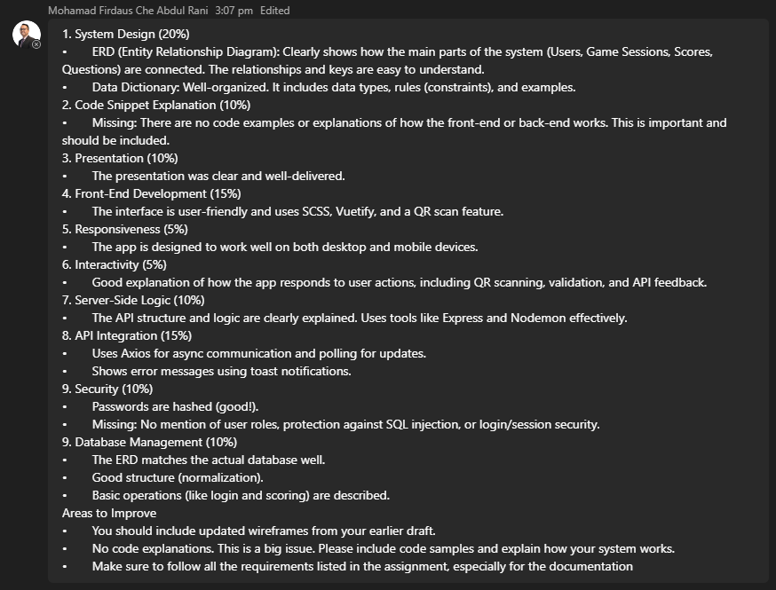
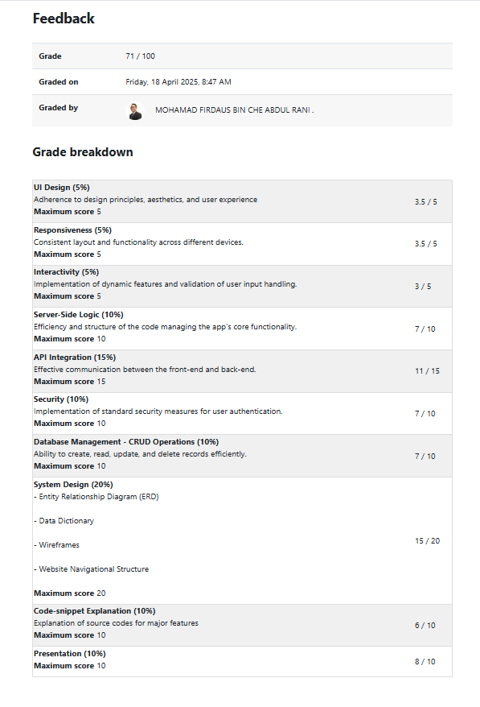

# Educational Chess: Learn Python via a Hybrid Chess Game ♟️

An innovative hybrid chess game that blends classic chess with Python learning. Players must answer Python questions to move pieces, making variables and data types engaging and practical.

> This project was developed as part of my Year 2 Further Web Design & Development module assignment.

---

## 🚀 Features
- 🎓 Learn Python variables and data types through interactive quizzes
- ♟️ Play chess while answering programming challenges
- 📱 Responsive (mobile, tablet, desktop)
- 🔑 Authentication (register & login)
- 🤝 Multiplayer with QR code join
- 📊 Scoreboard and game session tracking

---

## 🛠️ Tech Stack
- Frontend: Vue 3, Vite, Vuetify 3, Pinia
- Backend: Node.js, Express
- Database: MySQL

Project structure:
```
FWDD-Front/   # Vue.js frontend
FWDD-Back/    # Express backend + MySQL
FWDD-Back/db/ # SQL schema and seed data
```

---

## 📂 Setup Instructions

### 1) Clone the repo
```bash
git clone https://github.com/weiShen68/Educational-Chess-Game.git
cd Educational-Chess
```

### 2) Database setup (MySQL)
Create a database and import schema/seed data.
```sql
CREATE DATABASE chessboard;
```
```bash
mysql -u root -p chessboard < FWDD-Back/db/chessboard.sql
```

### 3) Backend setup
```bash
cd FWDD-Back
npm install
# Recommended during development
npm install --save-dev nodemon

# Create .env if needed (example):
# PORT=5000
# DB_HOST=localhost
# DB_USER=root
# DB_PASSWORD=yourpassword
# DB_NAME=chessboard

# Start (nodemon if installed)
npx nodemon index.js
# or
node index.js
```
Backend runs at `http://localhost:5000`.

### 4) Frontend setup
```bash
cd ../FWDD-Front
# Use one package manager; yarn shown here
npm install --global yarn
yarn install

# Start dev server
yarn dev
```
Frontend runs at `http://localhost:3000`.

---

## 🔐 Accounts
Create users via the Register page, then log in to start or join games.

---

## 🧭 Common Scripts
Backend (from `FWDD-Back`):
```bash
node index.js          # start
npx nodemon index.js   # dev with reload
```
Frontend (from `FWDD-Front`):
```bash
yarn dev   # start dev server
yarn build # production build
```

---

## 🧩 Notes
- Ensure MySQL is running and credentials in `.env` (or config) match your local setup.
- If ports differ, update frontend API URLs accordingly (default backend is `:5000`).
- For camera/QR features, use HTTPS or `localhost` and allow camera access in your browser's site settings (grant permission when prompted).

---

## 📝 Lecturer Comment

<!--  -->
---

## ⭐ Overall Score

<!--  -->

---

## 📜 License
MIT


